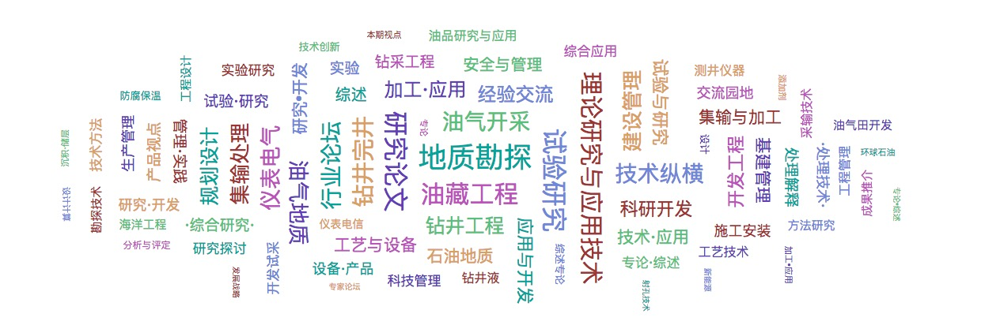

# TagCloud
A Word/Tag Cloud Library in Typescript.I am looking for an Word/Tag Cloud Library in Typescript Until I see an amazing Cloud in [Kibana](https://github.com/elastic/kibana).And I am not able to use it with `npm install ...` easily, So I separated it out, and modify it into an Library. Maybe the origin library is [tagcloud](https://github.com/stormpython/tagcloud.git)



## Getting Started

### Prerequisites

Require `Typescript`:

```
npm install -g typescript
```

### Installing

```
npm install tagcloud
```
### Usage
Basic Usage:

```
import { Word, TagCloud, Options } from "tagcloud";


let tagCloud = new TagCloud(theHTMlElement);

tagCloud.setOptions(opt:Options);

let tags:Word[]=[some words...]

tagCloud.setData(tags)

...

// when you need resize

tagCloud.resize();

'''

// Refresh the Data

tagCloud.setData(newTags);
```

## Built With

* [d3](https://github.com/d3/d3) - Bring data to life with SVG, Canvas and HTML. 
* [d3-cloud](https://github.com/jasondavies/d3-cloud) - Create word clouds in JavaScript.

## Contributing

And Issue or PR is Great.

## Authors

* **Mark Ma** - [markisme](https://github.com/markisme)

## License

This project is licensed under the MIT License - see the [LICENSE](LICENSE) file for details
